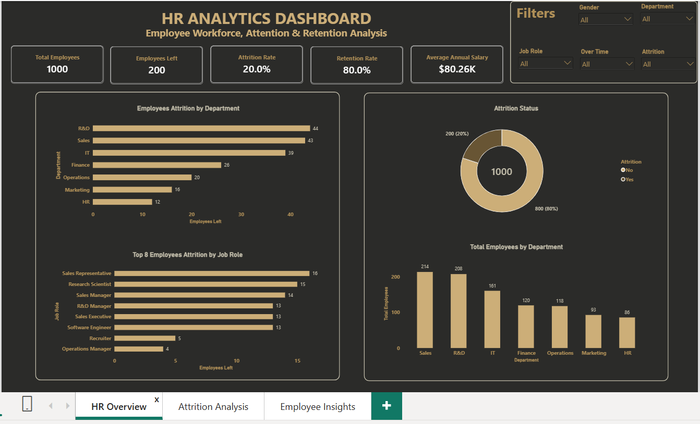
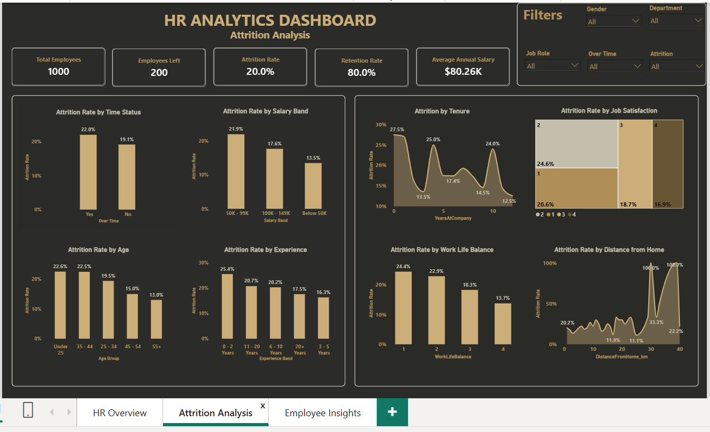
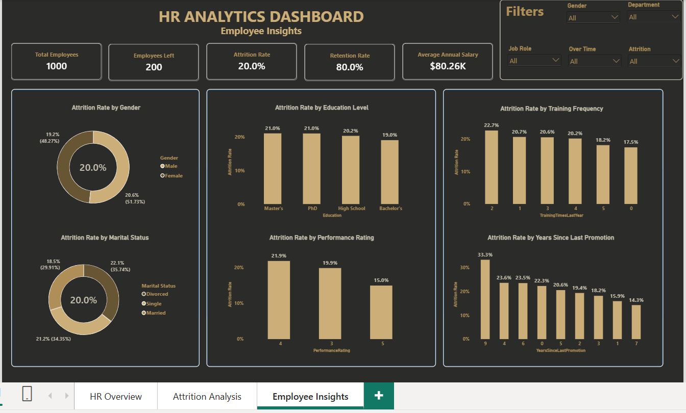

# HR Analytics Dashboard: Syntecxhub Internship

## 📊 Project Overview

This project was completed as part of my **Syntecxhub Data Analysis Internship**.

The project focuses on analyzing employee data to understand workforce composition, employee attrition, retention, salary patterns, and factors associated with employee turnover.

An interactive **Power BI HR Analytics Dashboard** was developed to transform employee data into meaningful insights that can support HR and organizational decision-making.

---

## 🎯 Project Objectives

The objectives of this project were to:

- Analyze employee workforce demographics and characteristics.
- Measure employee attrition and retention.
- Compare attrition across departments and job roles.
- Identify patterns associated with employee attrition.
- Examine attrition across salary, age, experience, tenure, and other factors.
- Build key HR performance indicators.
- Develop an interactive HR dashboard for decision-making.

---

## 🛠️ Tools & Technologies

- **Microsoft Excel** – Data inspection and preparation
- **Power Query** – Data cleaning and transformation
- **Power BI** – Data modeling, visualization, and dashboard development
- **DAX** – HR KPI calculations and analytical measures

---

## 🧹 Data Preparation

The employee dataset was cleaned and prepared using **Power Query** before being analyzed in Power BI.

The data preparation process included:

- Reviewing and validating data types
- Checking for missing values
- Checking for duplicate records
- Validating employee records
- Preparing categorical variables for analysis
- Creating analytical groups for age, salary, experience, and distance

The cleaned dataset was then loaded into Power BI for further analysis and visualization.

---

# 📈 Dashboard

The Power BI report consists of **three interactive pages**:

### 1. HR Overview

Provides a high-level overview of the organization's workforce, attrition, retention, salary, departments, and job roles.

### Key KPIs

- **Total Employees:** 1,000
- **Employees Left:** 200
- **Attrition Rate:** 20.0%
- **Retention Rate:** 80.0%
- **Average Annual Salary:** $80.26K

The page also includes:

- Employee Attrition by Department
- Top Employee Attrition by Job Role
- Attrition Status
- Total Employees by Department
- Interactive filters for Gender, Department, Job Role, Overtime, and Attrition

---

### 2. Attrition Analysis

This page explores employee attrition across different workforce characteristics.

The analysis includes:

- Attrition Rate by Overtime Status
- Attrition Rate by Salary Band
- Attrition Rate by Age Group
- Attrition Rate by Experience
- Attrition Rate by Tenure
- Attrition Rate by Job Satisfaction
- Attrition Rate by Work-Life Balance
- Attrition Rate by Distance from Home

Interactive filters allow users to explore the data by:

- Gender
- Department
- Job Role
- Overtime
- Attrition

---

### 3. Employee Insights

The Employee Insights page provides additional analysis of employee characteristics and their relationship with attrition.

The analysis covers areas such as:

- Gender
- Marital Status
- Education
- Performance Rating
- Training
- Years Since Last Promotion

This page provides a deeper view of workforce characteristics and helps identify areas that may require further HR investigation.

---

# 🖼️ Dashboard Screenshots

## HR Overview



## Attrition Analysis



## Employee Insights



> **Note:** Store the three dashboard screenshots inside an `images` folder using the following filenames:
>
> `hr-overview.png`  
> `attrition-analysis.png`  
> `employee-insights.png`

---

# 🔎 Key Insights

Based on the dashboard analysis, the following patterns were observed:

### Workforce & Attrition

- The dataset contains **1,000 employees**.
- **200 employees** have left the organization.
- The overall **attrition rate is 20.0%**.
- The overall **retention rate is 80.0%**.
- The average annual salary is approximately **$80.26K**.

### Department Attrition

The highest numbers of employee exits were recorded in:

- **R&D – 44 employees**
- **Sales – 43 employees**
- **IT – 39 employees**
- **Finance – 26 employees**
- **Operations – 20 employees**
- **Marketing – 16 employees**
- **HR – 12 employees**

These figures represent employee exit counts. Department size should therefore be considered when comparing departments.

### Job Role Attrition

The roles with higher numbers of employee exits include:

- Sales Representative
- Research Scientist
- Sales Manager
- R&D Manager
- Sales Executive
- Software Engineer

These figures represent **counts of employees who left**, rather than role-specific attrition rates.

### Overtime

Employees working overtime recorded a higher attrition rate:

- **Overtime: 22.0%**
- **No Overtime: 19.1%**

This shows an association between overtime status and attrition within the dataset.

### Age

Attrition varied across age groups:

- **Under 25: 22.6%**
- **35–44: 22.5%**
- **25–34: 19.5%**
- **45–54: 15.0%**
- **55+: 13.0%**

### Experience

Employees with **0–2 years of experience** recorded the highest attrition rate among the experience groups at **25.4%**.

### Work-Life Balance

Attrition varied across work-life balance ratings:

- **Rating 1: 24.4%**
- **Rating 2: 22.9%**
- **Rating 3: 18.3%**
- **Rating 4: 13.7%**

### Salary

Attrition rates varied across salary bands:

- **50K–99K: 21.9%**
- **100K–149K: 17.6%**
- **Below 50K: 13.5%**

This indicates that attrition was not simply highest among the lowest-paid employees in this dataset.

---

# 💡 HR Recommendations

Based on the patterns identified in the analysis, the following areas could be considered by HR teams:

### 1. Review Overtime Practices

Investigate workload distribution, overtime frequency, and employee scheduling, particularly among teams experiencing higher overtime levels.

### 2. Strengthen Early-Career Retention

Employees with **0–2 years of experience** recorded the highest attrition rate. HR could investigate onboarding, mentorship, career development, and employee support for early-career employees.

### 3. Improve Work-Life Balance

The higher attrition observed among employees with lower work-life balance ratings suggests that workload, flexibility, and employee wellbeing should be monitored.

### 4. Investigate Department-Level Differences

R&D, Sales, and IT recorded the highest numbers of employee exits. HR could investigate department-specific factors such as workload, job satisfaction, leadership, compensation, and career progression.

### 5. Examine Role-Specific Patterns

Roles with higher numbers of exits should be further analyzed using role-level attrition rates, employee satisfaction, salary, and tenure to determine whether the pattern is influenced by role size or higher turnover.

### 6. Monitor HR Trends Continuously

An interactive dashboard can be used to continuously monitor attrition, retention, workforce composition, and other HR indicators to support data-informed decision-making.

> **Note:** The findings represent patterns and associations within the dataset and should not be interpreted as proof that a particular factor directly causes employee attrition.

---

# 📌 Key DAX Measures

The dashboard uses DAX measures to calculate the main HR KPIs.

### Total Employees

```DAX
Total Employees =
DISTINCTCOUNT(Employee_Data[EmployeeID])
